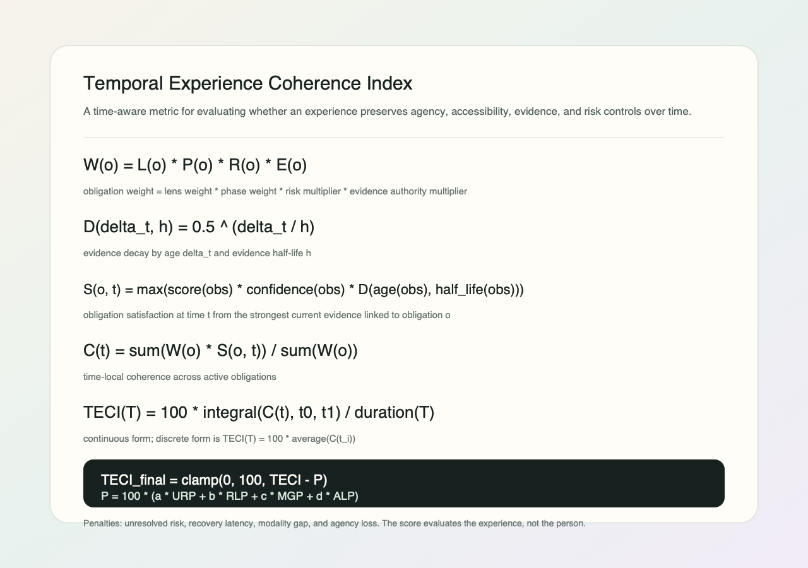

# H.U.M.A.N. Protocol

Humans do not move through the world as tasks, profiles, or conversion paths. We move through it as bodies, memories, questions, habits, fears, relationships, abilities, interruptions, hopes, and changing states of attention.

As AI systems begin to see, speak, summarize, suggest, decide, and act with us, the old language of interface design starts to feel too small. The question is no longer only what a screen should show. It is how a system should understand the human condition well enough to preserve agency, dignity, accessibility, and meaning across devices and time.

H.U.M.A.N. Protocol begins from that question.

## What It Is

**Human Understanding for Multimodal Agentic Navigation**

H.U.M.A.N. Protocol is an open working draft for describing human-centered experiences across devices, AI agents, accessibility contexts, and time.

It is a loose schema and shared language for representing human intent, context, modality, agency, accessibility, risk, evidence, and social meaning so product teams and AI systems can reason more clearly about interaction.

Maintained by Decantr AI as an open research and spec initiative, H.U.M.A.N. is not a UI framework, product suite, compliance standard, or replacement for accessibility standards.

## Explore The Draft

| Section | Purpose |
| --- | --- |
| [Spec v0.1](spec/human-protocol-v0.1.md) | The current narrative specification. |
| [Schema](spec/human-protocol.schema.json) | Loose JSON Schema for structured H.U.M.A.N. documents. |
| [Temporal Experience Coherence Index](algorithms/temporal-experience-coherence-index.md) | Draft time-aware metric for evaluating agency, accessibility, evidence, and risk over time. |
| [Healthcare Intake](examples/healthcare-intake.yaml) | High-risk AI-assisted form example. |
| [AI Assistant Action](examples/ai-assistant-action.yaml) | Delegated AI action and consent example. |
| [Cross-Device Handoff](examples/cross-device-handoff.yaml) | Multimodal device continuity example. |
| [Social Messaging AI](examples/social-messaging-ai.yaml) | AI-mediated communication example. |
| [Principles](principles/) | Core lenses: agency, accessibility, temporality, multimodality, evidence, and social meaning. |
| [Standards And Sources](references/standards-and-sources.md) | External standards and guidance this work references. |
| [Contributing](CONTRIBUTING.md) | How to critique or improve the draft. |

## Why This Exists

Interfaces are no longer only screens with controls. Modern experiences increasingly include:

- phones, desktops, wearables, vehicles, spatial devices, kiosks, and smart environments
- touch, keyboard, voice, gaze, gesture, haptics, captions, and assistive technology
- AI assistants, agents, copilots, automation, memory, and delegated action
- social mediation through suggested replies, translation, summarization, avatars, and generated content
- accessibility requirements, legal obligations, platform conventions, and human trust concerns

The industry has excellent specialized standards and design systems, but there is still a missing shared layer for asking:

> What is the human trying to do, under what conditions, through which modalities, with what agency, over what time horizon, and with what risk?

H.U.M.A.N. Protocol is an attempt to name that layer.

## Temporal Metric



The [Temporal Experience Coherence Index](algorithms/temporal-experience-coherence-index.md) is a draft algorithm for scoring the experience, not the person. It treats time as a first-class UX dimension by asking whether agency, accessibility, evidence, modality support, risk recovery, and social meaning hold across phases like before, during, after, interruption, recovery, and repeated use.

## Core Idea

Every meaningful experience can be described through a small set of lenses:

| Lens | Question |
| --- | --- |
| Human intent | What is the person trying to do, understand, decide, avoid, or become? |
| Context | Where, when, and under what constraints is the interaction happening? |
| Modality | How does the person act and perceive across input, output, body, device, and assistive paths? |
| Interface | What patterns, surfaces, controls, representations, and feedback mediate the experience? |
| Time | What happens before, during, after, repeatedly, after interruption, and after failure? |
| Agency | Who or what is acting: human, system, AI agent, automation, institution, or another person? |
| Accessibility | Who might be excluded, and what alternate paths preserve equivalent participation? |
| Evidence | What supports each claim: standard, law, platform guidance, research, test, policy, or hypothesis? |
| Risk | What can go wrong, and how is harm prevented, surfaced, repaired, or escalated? |
| Social meaning | How does this experience shape relationships between people? |

## Draft Example

```yaml
human_protocol_version: "0.1"
experience:
  name: "AI-assisted healthcare intake"
  domain: "healthcare"
  purpose: "Help patients complete intake before a visit while preserving accuracy, privacy, and agency."

human_intent:
  primary_goal: "Provide required medical information accurately."
  emotional_context:
    - anxious
    - time_constrained
    - privacy_sensitive
  success_means:
    - "Patient understands what is being asked."
    - "Patient can correct mistakes."
    - "Provider receives structured information."

agency:
  human_control:
    - edit
    - undo
    - pause
    - opt_out
    - request_human_help
  ai_role:
    - summarize
    - clarify
    - suggest
  ai_limits:
    - "Must not diagnose."
    - "Must not submit without explicit confirmation."

risk:
  high_risk:
    - medical_misinformation
    - privacy_leakage
    - false_confidence
    - inaccessible_required_task
  mitigations:
    - explicit_review_step
    - audit_trail
    - human_support
    - correction_flow
```

See [examples/healthcare-intake.yaml](examples/healthcare-intake.yaml) for the fuller version.

## What This Is

- A shared vocabulary for human-centered interaction in an AI-mediated world.
- A loose JSON/YAML shape for describing experiences.
- A way to connect design intent, accessibility, risk, evidence, and temporal behavior.
- A thinking tool for designers, researchers, engineers, product teams, policy-minded builders, and AI systems.
- A place to explore how machines should represent human context without reducing humans to profiles or metrics.

## What This Is Not

- Not a compliance standard.
- Not a UI component library.
- Not a replacement for WCAG, WAI-ARIA, ISO 9241, EN 301 549, platform HIGs, or local design systems.
- Not a claim to model all human cognition.
- Not an AI-first design doctrine.
- Not a framework that tells every team to design the same way.

## Repository Map

```text
spec/
  human-protocol-v0.1.md       Draft narrative specification
  human-protocol.schema.json   Loose JSON Schema for structured documents

examples/
  healthcare-intake.yaml
  ai-assistant-action.yaml
  cross-device-handoff.yaml
  social-messaging-ai.yaml

principles/
  accessibility.md
  agency.md
  temporality.md
  multimodality.md
  social-meaning.md
  evidence.md

references/
  standards-and-sources.md
```

## Draft Status

This repository starts as a working draft. Early versions should stay modest, legible, and example-driven.

The goal is not to create a grand theory before there is practical shape. The goal is to define a useful language, test it against real experiences, and revise it in public.

## Design Commitments

H.U.M.A.N. Protocol should remain:

- **Human-centered:** machines are participants in the system, not the center of the system.
- **Accessible by default:** accessibility is structural, not decorative.
- **Temporal:** experiences unfold across time, memory, interruption, repair, and repeated use.
- **Evidence-aware:** claims should disclose whether they come from standards, research, tests, law, policy, or hypothesis.
- **Agency-preserving:** automation should not erase consent, control, authorship, or recourse.
- **Socially literate:** AI-mediated experiences shape relationships between people.
- **Loose before rigid:** useful examples matter more than premature formalism.

## Contributing

See [CONTRIBUTING.md](CONTRIBUTING.md).

## License

MIT. See [LICENSE](LICENSE).
